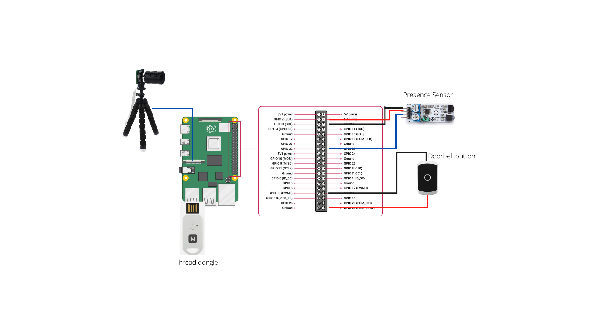

# RPI Camera

# OS installation
You can use the [Raspberry Pi Imager](https://www.raspberrypi.com/software/) to flash the last 64-bit Bullseye ligth version (no desktop)


# Initial setup

Use raspi-config to configure the RPI
```bash
sudo raspi-config
```
- Configure the camera interface
- Configure the SSH interface
- Connect to your Wi-Fi network (you must have an internet connection)

## Update OS

```bash
sudo apt update
sudo apt upgrade
```

## Install and configure git

```bash
sudo apt install git
git config --global user.name "Nicolas44Hernandez"
git config --global user.email n44hernandezp@gmail.com
```

## Create and add ssh key to your github account

Complete ssh key setup is explained in the following [link](https://docs.github.com/es/authentication/connecting-to-github-with-ssh/generating-a-new-ssh-key-and-adding-it-to-the-ssh-agent)

## Clone rpi_camera repository

```bash
mkdir workspace
git clone git@github.com:Nicolas44Hernandez/GreenHomeLan_RpiCamera.git
```

## Install pip3

```bash
sudo apt-get install python3-pip
```

## Install opencv
The complete installation instruction could be found [here](https://qengineering.eu/install-opencv-lite-on-raspberry-pi.html)

## Install the dependencies
```bash
cd GreenHomeLan_RpiCamera
pip install -r server_camera/requirements.txt
```

To add the dependencies to PATH, edit the `bashrc` file

```bash
nano ~/.bashrc
```
add line
```
export PATH="$PATH:/home/pi/.local/bin"
```

## Add the WiGreen Wi-Fi network configuration

Edit the file `wpa_supplicant.conf`
```bash
sudo nano /etc/wpa_supplicant/supplicant.conf
```

replace netxwork config by
```
network={
        ssid="Livebox-Wigreen"
        psk="Wigreen1234"
}
```

## Create log files

Log files defined in configuration file located in *server_box/server/config/logging-config.yml* must be created before launching the application

```bash
mkdir logs
mkdir logs/manager
mkdir logs/interface
mkdir logs/notification
touch logs/app.log logs/api-rest.log
touch logs/manager/mqtt.log logs/manager/thread.log logs/manager/doorbell.log logs/manager/presence_detection.log logs/manager/video.log logs/manager/wifi_connection.log
touch logs/interface/mqtt.log logs/interface/gpio.log logs/interface/thread.log logs/interface/video_capture.log
touch logs/notification/notification.log
```

# Hardware connection
Connect the camera, doorbell button and presence sensor to the RPI


## Set the app as a service

Copy the service file
```bash
sudo cp server_camera/service/rpi-camera.service /etc/systemd/system/
```

Register service
```bash
sudo systemctl daemon-reload
sudo systemctl enable rpi-camera
sudo systemctl restart rpi-camera
```
